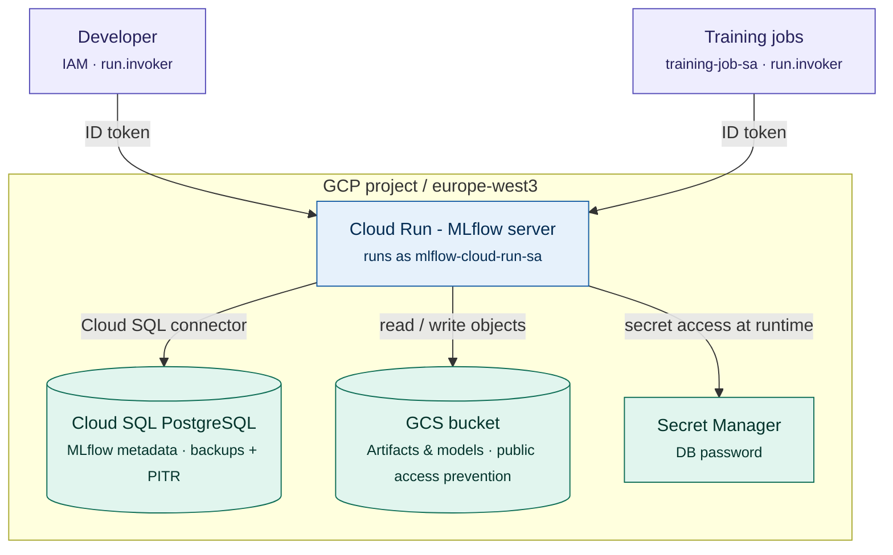

# GCP MLflow Platform
 
Terraform-based, modular infrastructure for deploying a secure, self-hosted **MLflow** instance on Google Cloud Platform using Cloud Run, Cloud SQL PostgreSQL, Google Cloud Storage, Secret Manager, and least-privilege IAM.
 
The platform was deployed and validated end to end on a live GCP project.

## Overview
 
MLflow needs three things to run as a tracking server: a backend store for metadata (experiments, runs, params, metrics), an artifact store for models and files, and a set of credentials. This project provisions all of them as managed GCP services, wires them together with least-privilege identities, and exposes MLflow through an access-controlled Cloud Run service.
 
The design separates **reusable modules** (the building blocks) from an **environment** (`dev`) that composes them, so additional environments (staging, prod) can be added without duplicating logic.

## Repository Structure
```text
terraform/
├── environments/
│   └── dev/
│       ├── main.tf                 # composes the modules + access bindings
│       ├── variables.tf
│       ├── outputs.tf
│       └── terraform.tfvars.example
└── modules/
    ├── gcs_bucket/                 # artifact store
    ├── service_account/            # reusable service account
    ├── secret_manager/             # secret + version
    ├── mlflow_iam/                 # least-privilege role bindings
    ├── cloud_sql/                  # PostgreSQL backend store
    └── cloud_run_mlflow/           # MLflow service
docker/
└── mlflow/Dockerfile               # reference image build
```

| Module | Responsibility |
| --- | --- |
| `gcs_bucket` | Artifact store with public-access prevention, UBLA, and versioning. |
| `service_account` | Reusable, parameterized service account. |
| `secret_manager` | Creates a secret and its first version (e.g. the DB password). |
| `mlflow_iam` | Binds least-privilege roles (storage, secret accessor, Cloud SQL client) to the runtime SA. |
| `cloud_sql` | PostgreSQL 16 instance, database, and user with backups + PITR. |
| `cloud_run_mlflow` | Cloud Run v2 service running the MLflow server, wired to SQL, GCS, and Secret Manager. |

## Architecture



**Request flow.** Developers and internal training jobs each authenticate with their own identity and call the Cloud Run service using a Google-issued ID token. The MLflow server runs as a dedicated runtime service account (`mlflow-cloud-run-sa`); it reaches PostgreSQL through the built-in Cloud SQL connector (a Unix socket, no exposed connection string), reads/writes artifacts in the GCS bucket, and pulls the database password from Secret Manager at container startup. Human and workload access are separated, and credentials for the data layer never leave the Cloud Run service.
 
## Security design
 
Security was a primary design goal, not an afterthought. Key decisions:
 
- **No secrets in source or images.** The database password is stored in Secret Manager and injected into the container at runtime via a secret reference. Nothing sensitive is hardcoded in the Terraform, the image, or environment values committed to the repo. (`*.tfvars` and state files are git-ignored.)
- **Least-privilege IAM.** The MLflow runtime service account is granted only what it needs: object access on a single artifact bucket, `secretmanager.secretAccessor` on a single secret, and `cloudsql.client`. No project-wide `editor` or `owner` roles are used.
- **Separate identity per workload.** A dedicated `training-job-sa` is used by internal training jobs and granted only `run.invoker` on the MLflow service. It has **no** GCS, Cloud SQL, or Secret Manager permissions — training jobs talk to MLflow's HTTP API, and MLflow (not the job) reaches the data layer. This keeps the trust boundary tight.
- **Access-controlled Cloud Run.** No `allUsers` binding exists; only explicit identities hold `run.invoker`, so anonymous callers receive `403`. Access is IAM-protected.
- **Hardened object storage.** The artifact bucket enforces public access prevention and uniform bucket-level access, with object versioning enabled.
- **Resilient database.** Cloud SQL has automated backups and point-in-time recovery enabled.
- **EU data residency.** All resources are deployed in `europe-west3` (Frankfurt) with an `EU`-located bucket, keeping data within the EU.

## Prerequisites
 
- Terraform `>= 1.6`
- `gcloud` CLI, authenticated (`gcloud auth application-default login`)
- A GCP project with billing enabled
- The following APIs enabled: Cloud Run, Cloud SQL Admin, Secret Manager, Cloud Storage, Artifact Registry, IAM
- A container image for the MLflow server available in Artifact Registry (see `docker/mlflow/`)

## Configuration
 
| Variable | Description | Default |
| --- | --- | --- |
| `project_id` | Target GCP project ID. | (required) |
| `region` | Deployment region. | `europe-west3` |
| `db_password` | Password for the MLflow PostgreSQL user (sensitive). | (required) |
 
Copy the example file and fill in your values:
 
```bash
cp terraform/environments/dev/terraform.tfvars.example terraform/environments/dev/terraform.tfvars
```
 
```hcl
# terraform.tfvars
project_id  = "your-project-id"
db_password = "choose-a-strong-password"
# region    = "europe-west3"   # optional override
```
 
## Deployment
 
```bash
cd terraform/environments/dev
 
terraform init
terraform plan
terraform apply
```
 
Useful outputs after apply include the Cloud Run service URL, the artifact bucket name, the Cloud SQL connection name, and the runtime service account email.
 
## Accessing MLflow
 
The service is **IAM-protected**, so it cannot be opened anonymously in a browser, a valid Google identity token is required. The simplest way to reach the UI locally is the authenticated proxy:
 
```bash
gcloud run services proxy mlflow-dev --region europe-west3
# then open http://localhost:8080
```
 
For programmatic access (e.g. training jobs), the calling identity must hold `run.invoker` and send an ID token in the `Authorization` header.

Or using your Google Identity Token

```bash
# Unauthenticated request (expected: 403 Forbidden)
curl -I https://mlflow-dev-3o4zsum6gq-ey.a.run.app

# Authenticated request (expected: MLflow HTML response)
curl -H "Authorization: Bearer $(gcloud auth print-identity-token)" \
https://mlflow-dev-3o4zsum6gq-ey.a.run.app

# Verify Cloud Run IAM policy
gcloud run services get-iam-policy mlflow-dev \
  --region=europe-west3

# Describe Cloud Run service
gcloud run services describe mlflow-dev \
  --region=europe-west3

## Cost notes
 
Cloud SQL is the primary cost driver because it runs continuously; the `dev` environment uses a small tier to keep this low. Cloud Run scales to zero (`min_instances = 0`), so it costs almost nothing when idle. GCS and Secret Manager costs are negligible at this scale.
 
## Known limitations & production next steps
 
This is a security-conscious POC. For production, the prioritized next steps are:
 
1. **Remote, locked state.** Move Terraform state to a versioned, encrypted GCS backend with state locking (state currently lives locally and can contain sensitive values).
2. **Private database networking.** Switch Cloud SQL to a private IP via Private Service Access and disable the public IP; the Cloud SQL connector already keeps traffic off the public connection string.
3. **CI/CD with policy-as-code.** Add a pipeline that runs `terraform fmt`/`validate`, `plan` on pull requests, and a security scanner (Checkov / tfsec), applying only from `main` via Workload Identity Federation (no SA keys).
4. **IAP for human access.** Front the service with an external HTTPS load balancer + Identity-Aware Proxy for browser SSO, and restrict ingress accordingly.
5. **Observability.** Add uptime checks, alerting on errors and database load, and Cloud Audit Logs for data-access visibility.
6. **Manage Artifact Registry in Terraform.** Bring the image repository under IaC so the full supply chain is reproducible.
7. **Tighten further.** Use `roles/storage.objectUser` instead of `objectAdmin`, add a bucket lifecycle rule to expire old object versions, and generate the DB password with `random_password` so it is never supplied by hand.
 
